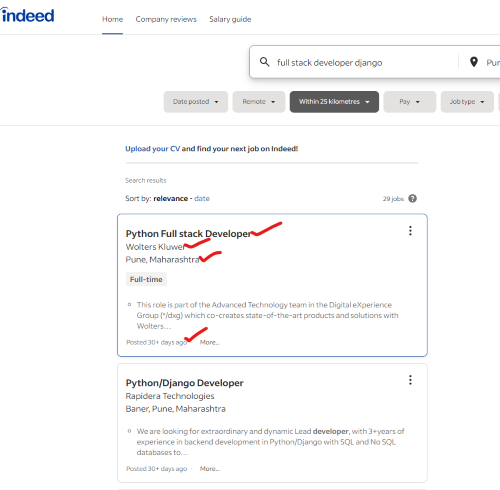

# Indeed.com Jobs Scraper in Python with Selenium Library

## Installation
1. Clone the repo

```bash
git clone https://github.com/vilash99/indeed_jobs_scraper_selenium.git
```
2. Setup virtual environment & Install Requirements

```bash
python -m venv .venv
.venv/Scripts/activate
pip install -r requirements.txt
```

3. Run the script
```bash
python indeed_jobs_scraper.py
```

## Which fields are being scrapped?



## Contribution
Feel free to contribute to the project by submitting bug reports, feature requests, or pull requests. Your contributions are highly appreciated.

## License
This project is licensed under the MIT License.

## Contact me
If you need a script similar to this or have new requirements. You can contact me at vilashdd[at]gmail[com].

My website: https://vilashdaate.com/

My blog: https://www.kushalstudy.com/
